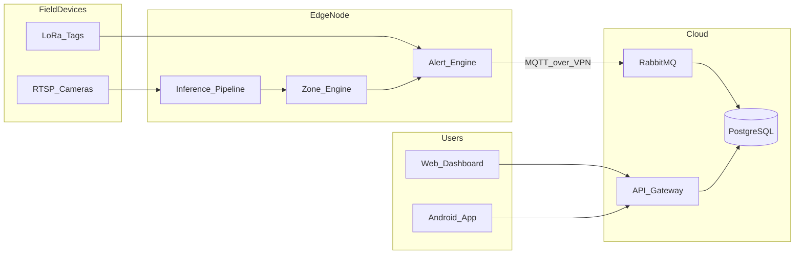

# SudarshanChakra — System Architecture

**Enterprise smart farm hazard detection and security**

This document explains **how the whole system fits together** in language that managers, new developers, and curious farm operators can follow. You do **not** need to be an expert in AI or networking to understand the big ideas. Technical terms are introduced gently and collected again in a [Glossary](#12-glossary) at the end.

---

## How to read this document

| If you are… | Focus on… |
|-------------|-----------|
| **Farm owner / operator** | [§2 Plain-language overview](#2-plain-language-overview-what-is-this-really), [§3 Day in the life](#3-day-in-the-life-of-one-alert), [§11 Reliability](#11-reliability-and-recovery) |
| **Product / project manager** | [§2](#2-plain-language-overview-what-is-this-really), [§4](#4-big-picture-one-page), [§9](#9-apis-and-apps-how-people-touch-the-system) |
| **Developer (new to repo)** | [§5](#5-where-everything-lives-in-the-repo), [§6](#6-edge-ai-node-on-the-farm), [§7](#7-cloud-platform-vps), [§8](#8-messaging-and-data-stores) |
| **ML / CV engineer** | [§6.3](#63-ai-pipeline-in-simple-steps), [§10](#10-ai-zones-and-safety-rules) |

---

## 1. Document info

| Item | Detail |
|------|--------|
| **Purpose** | Describe architecture **breadth** (all major parts) and enough **depth** to orient a normal reader |
| **Scope** | IoT cameras, edge AI, cloud services, mobile/web clients, optional PA/siren hardware |
| **Deployment example** | Farm site (e.g. Sanga Reddy, India) + cloud VPS; exact hostnames may vary per environment |

---

## 2. Plain-language overview — what is this, really?

### 2.1 The problem in one paragraph

Farms need **eyes everywhere**: dangerous animals (snakes, scorpions), fire and smoke, people or children in unsafe areas (e.g. near a pond), and livestock leaving safe zones. Humans cannot watch eight camera feeds 24/7. **SudarshanChakra** uses **computers on the farm (edge)** to watch the cameras in real time with **AI**, applies **rules** (virtual fences, worker badges), and sends **clear alerts** to a **cloud** system so dashboards and phones can react — including triggering a **siren** when policy says so.

### 2.2 The solution in four plain steps

1. **Cameras** send video to a **small datacenter on the farm** (a PC with a GPU).
2. That PC runs **object detection** (finding “person”, “snake”, “fire”, etc.) and asks: **Is this in a dangerous zone? Should we trust this detection? Is a known worker nearby?**
3. If it is a real incident, the edge node sends a message **through a private tunnel (VPN)** to the **cloud**.
4. The cloud **stores** the alert, shows it on a **web dashboard** and **Android app**, and can **command** loudspeakers or sirens on site.

### 2.3 Why not “just use the cloud for AI”?

- **Latency**: Safety events need fast local reaction; sending every video frame to the internet is slow and expensive.
- **Bandwidth**: Eight HD streams 24/7 is costly; the farm keeps video local and only sends **small alert messages** and optional snapshots.
- **Privacy / resilience**: If the internet blips, the edge can still detect; the VPN reconnects when the link returns.

---

## 3. “Day in the life” of one alert

**Story (simplified):**

1. **Camera 3** shows a person stepping into a **virtual fence** drawn around the pond (a polygon on the video).
2. The **edge** AI says: “person, high confidence.” **Filters** check shape and history to reduce false alarms.
3. The **zone engine** says: “This zone is **zero tolerance** (pond safety) — do **not** suppress just because a worker tag might be elsewhere.”
4. The **alert engine** builds a JSON alert and publishes it on **MQTT** (a lightweight messaging bus) toward the cloud path.
5. In the **cloud**, **RabbitMQ** routes the message to **alert-service**, which **saves** it in **PostgreSQL** and may **push** updates over **WebSocket** to anyone viewing the dashboard.
6. An operator **acknowledges** the alert in the app; **siren-service** can publish a **stop** command if the siren was triggered.

You do not need to remember every product name — the point is: **video → local AI → rules → message bus → database → people.**

---

## 4. Big picture (one page)

### 4.1 Layers (mental model)

Think of four stacked layers:

```text
┌─────────────────────────────────────────────────────────────────────────┐
│  PEOPLE & APPS                                                          │
│  Web dashboard (browser) · Android app · optional on-farm PA / siren      │
└───────────────────────────────────┬─────────────────────────────────────┘
                                    │ HTTPS, WebSocket, MQTT (TLS where configured)
┌───────────────────────────────────▼─────────────────────────────────────┐
│  CLOUD (VPS)                                                            │
│  API gateway · microservices · PostgreSQL · RabbitMQ · Nginx              │
└───────────────────────────────────┬─────────────────────────────────────┘
                                    │ VPN tunnel (private IP space, e.g. 10.8.0.x)
┌───────────────────────────────────▼─────────────────────────────────────┐
│  EDGE (on-farm PC + GPU)                                                │
│  Video ingest · YOLO inference · zones · LoRa tags · local Flask UI      │
└───────────────────────────────────┬─────────────────────────────────────┘
                                    │ RTSP (cameras) · USB serial (LoRa) · LAN
┌───────────────────────────────────▼─────────────────────────────────────┐
│  FIELD DEVICES                                                          │
│  IP cameras · ESP32 / LoRa worker tags · sensors (e.g. water level)      │
└─────────────────────────────────────────────────────────────────────────┘
```

### 4.2 Visual flow (data)



---

## 5. Where everything lives in the repo

Monorepo layout (high level):

| Folder | Role |
|--------|------|
| `edge/` | Python edge runtime: inference, zones, MQTT, Flask GUI |
| `backend/` | Java Spring Boot: gateway, auth, devices, alerts, siren |
| `dashboard/` | React web UI (Vite + TypeScript) |
| `android/` | Kotlin / Jetpack Compose mobile app |
| `cloud/` | Docker Compose, DB schema (`db/init.sql`), RabbitMQ helpers |
| `firmware/` | ESP32 / Arduino examples (e.g. tags, sensors) |
| `AlertManagement/` | Raspberry Pi PA / audio sidecar (optional) |
| `e2e/` | Optional full-stack smoke tests |

This mirrors the **logical** architecture: **edge**, **cloud services**, **clients**, **infra**.

---

## 6. Edge AI node (on the farm)

### 6.1 What hardware is it?

Typical target (can vary):

- **CPU + GPU** PC (e.g. Core i5 class + **NVIDIA RTX 3060** class) with enough RAM for several camera streams.
- **Cameras** on the LAN: RTSP (e.g. TP-Link VIGI / Tapo style setups).
- Optional **LoRa USB receiver** for **worker tags** (wearables) to know authorized people nearby.
- Optional **local MQTT** bridge for **water level** or other IoT readings.

### 6.2 Main software pieces (names you will see in code)

| Module (concept) | Plain English |
|------------------|---------------|
| **Pipeline** | Reads frames from each camera on a schedule, runs **YOLO** detection, hands results to the rest of the system. |
| **Zone engine** | Stores **polygons** (virtual fences) per camera; checks if a detection’s **foot point** is inside the right area. |
| **Detection filters** | Reduces false positives: confidence, shape, night tweaks, temporal confirmation for fire/smoke/scorpion, optional **suppression rules file**. |
| **Alert engine** | Combines zone logic + **LoRa “worker nearby”** fusion + deduplication, then **publishes** alerts. |
| **Flask GUI (`edge_gui`)** | Browser UI on the edge (e.g. port 5000) to draw zones, see **health**, **camera status**, **model path**, snapshots. |
| **MQTT client** | Talks to the broker (often via **VPN**) for alerts, heartbeats, siren commands, **admin** messages. |

### 6.3 AI pipeline in simple steps

```text
Camera RTSP  →  grab thread per camera  →  frame queue  →  YOLO inference
      →  filter detection  →  zone check  →  LoRa fusion  →  MQTT publish
```

**Threading (why it matters):** each camera’s grabber runs in its own thread so one slow stream does not block others; the GPU runs inference as frames arrive; MQTT and Flask run on their own loops/threads.

### 6.4 Admin and hot reload (operator-friendly)

The edge can react to **MQTT topics** (when enabled and connected), for example:

- **`farm/admin/reload_config`** — reload **zones** and **suppression rules** without restarting the container.
- **`farm/admin/model_update`** — point inference at a **new model file** (`.pt` / `.engine`) when valid paths are provided.

A **file watcher** (optional dependency: `watchdog`) can also reload when `zones.json` or `suppression_rules.json` changes on disk.

### 6.5 Key design choices (edge)

| Decision | Why |
|----------|-----|
| **Single efficient model** (e.g. YOLOv8n-class) | Many cameras × low latency per frame on a mid-range GPU. |
| **TensorRT / FP16** (when used) | Big speedup with small accuracy tradeoff; safety prefers stability over marginal speed. |
| **Bottom-center in polygon** | Represents **where feet stand**, not the center of a tall bounding box. |
| **MQTT over VPN** | Broker is not exposed on the public internet; tunnel reconnects after outages. |

---

## 7. Cloud platform (VPS)

### 7.1 What runs there?

Typical **Docker Compose** style deployment:

| Piece | Port (typical) | Plain English |
|-------|----------------|---------------|
| **PostgreSQL** | 5432 | System of record: users, devices, alerts, audit, optional water tanks, health logs. |
| **RabbitMQ** | 5672 (AMQP), 1883 (MQTT plugin if enabled) | Message **router** between edge patterns and Java consumers. |
| **api-gateway** | 8080 | Single front door for **REST**; routes paths to the right microservice. |
| **alert-service** | 8081 | Consumes alert queues, persists alerts, **WebSocket** broadcast to dashboards. |
| **device-service** | 8082 | CRUD for **nodes, cameras, zones, worker tags**, water tank registry, etc. |
| **auth-service** | 8083 | **JWT** login/register, user records. |
| **siren-service** | 8084 | Records siren actions, publishes **trigger/stop** commands to the bus. |
| **Nginx** | 80/443 | TLS termination, static dashboard hosting (layout varies by deployment). |

### 7.2 Why microservices?

So **alerts**, **devices**, **auth**, and **siren** can be **scaled or deployed independently** (e.g. patch siren logic without touching auth). The **API gateway** keeps the **browser/app** simple: one base URL.

### 7.3 API gateway routes (conceptual)

All under **`/api/v1/`** (exact paths in [API_REFERENCE.md](./API_REFERENCE.md)):

- **Auth** → auth-service  
- **Alerts** → alert-service  
- **Nodes, cameras, zones, tags, water** → device-service  
- **Siren** → siren-service  

---

## 8. Messaging and data stores

### 8.1 RabbitMQ (bus)

Think of **exchanges** as **labeled mail sorters** and **queues** as **inboxes** for services.

| Exchange (example) | Role |
|--------------------|------|
| **farm.alerts** (topic) | Routes edge-originated alerts by **severity / routing key**. |
| **farm.commands** (direct) | Cloud → edge style commands (e.g. siren). |
| **farm.events** (topic) | Status, heartbeats, camera events, suppression audit. |
| **farm.water** (topic) | Water level / tank related messages (when used). |
| **farm.dead-letter** (fanout) | Holds messages that failed processing for inspection. |

**Queues** (examples): `alert.critical`, `alert.high`, `alert.warning`, `water.level`, etc. Exact bindings are created by **`cloud/scripts/rabbitmq_init.py`** in a proper deployment.

### 8.2 PostgreSQL (database)

**Domains** (conceptual):

- **Identity** — users, roles.  
- **Inventory** — edge nodes, cameras, zones, worker tags, water tanks.  
- **Operations** — alerts, siren audit, suppression log, node health, summaries.

The canonical schema is in **`cloud/db/init.sql`**.

### 8.3 MQTT topics (plain map)

**Edge → cloud (examples):**

- `farm/alerts/{priority}` — alert payloads.  
- `farm/nodes/{id}/status` — online/offline (often **retained** so last state is visible).  
- `farm/nodes/{id}/heartbeat` — periodic health.  
- `farm/events/...` — various events (e.g. worker identified / suppression audit).

**Cloud → edge (examples):**

- `farm/siren/trigger`, `farm/siren/stop` — siren control.  
- `farm/admin/update`, `farm/admin/reload_config`, `farm/admin/model_update` — operations / OTA-style workflows (exact support depends on edge version and config).

**Edge → cloud (ack):**

- `farm/siren/ack` — confirms siren command handling where implemented.

---

## 9. APIs and apps — how people touch the system

### 9.1 Web dashboard

- **React** SPA, talks to **API gateway** over HTTPS.  
- **JWT** stored in the browser after login (see project conventions).  
- **WebSocket** (via SockJS/STOMP) for **live alert** updates when backend is available.

### 9.2 Android app

- **Kotlin**, Compose UI, **Retrofit** for REST, **MQTT** client for realtime paths as designed.  
- Same logical APIs: login, alerts, devices, siren where exposed.

### 9.3 Typical REST capabilities

| Area | Examples |
|------|----------|
| Auth | Register, login, JWT refresh patterns (see API reference). |
| Alerts | List, filter, get by id, acknowledge, resolve, false positive. |
| Devices | Nodes, cameras, zones, worker tags, water tanks. |
| Siren | Trigger, stop, history. |

---

## 10. AI, zones, and safety rules

### 10.1 Detection classes (example taxonomy)

The model is trained / configured for **farm-relevant classes** (exact list may evolve). Examples:

| Class | Typical risk angle |
|-------|-------------------|
| person / child | Intrusion, pond safety |
| cow | Containment (inside/outside polygon rules) |
| snake / scorpion | Venomous wildlife |
| fire / smoke | Early fire warning |
| dog / vehicle / bird | Often **informational** or **suppressed** from alerts |

### 10.2 Zone types (behavioral summary)

| Zone type | Plain English |
|-----------|---------------|
| **intrusion** | Object **inside** polygon → alert; **authorized worker nearby** may suppress. |
| **zero_tolerance** | Object **inside** → alert; **strong safety** (e.g. pond): typically **not** suppressed by worker presence. |
| **livestock_containment** | Animal **outside** safe polygon → alert. |
| **hazard** | Object **inside** dangerous region → alert; may allow worker suppression depending on policy. |

### 10.3 Filter layers (intuition)

```text
Confidence  →  geometry / size  →  color or texture (fire/smoke)  →  time-based confirmation
  →  zone relevance  →  worker fusion  →  deduplication window
```

**Suppression file:** `edge/config/suppression_rules.json` can list classes (and optionally **per-camera** IDs) to **ignore** for alerts, reloadable via MQTT or file watch.

---

## 11. Reliability and recovery

| Scenario | What the system tries to do |
|----------|------------------------------|
| **Edge reboot** | Docker / service manager restarts containers; OpenVPN reconnects. |
| **VPN drop** | Keepalives + client **reconnect**; **Last Will** on MQTT can mark node offline. |
| **Camera disconnect** | Per-camera **backoff** before reconnecting RTSP (avoid hammering the camera). |
| **Broker unavailable** | MQTT client **reconnect**; alerts may backlog or drop depending on QoS and disk (operational choice). |
| **Database stress** | Pooling, limits, healthchecks in compose; scale VPS if needed. |

**Important:** “Highly available” still depends on **power**, **ISP**, and **correct ops** (backups, monitoring). This table describes **software behavior**, not a formal SLA.

---

## 12. Deployment and operations (overview)

| Layer | Typical update |
|-------|----------------|
| **Cloud** | Pull new images / jars, `docker compose up`, run DB migrations **only** via controlled processes (schema from `init.sql` + ops discipline). |
| **Edge** | Pull new container image over VPN; **model** swap via file + MQTT or manual replace. |
| **Firmware** | Often **USB** flash unless you add OTA later. |

**CI:** GitHub Actions can build **backend** services per module; integration tests may use **Testcontainers** (Docker required) — see `backend/build.gradle.kts` and `integrationTest` task.

---

## 13. Glossary

| Term | Simple meaning |
|------|----------------|
| **Edge** | Compute **on the farm**, next to cameras. |
| **VPS** | Virtual private server in a datacenter (“the cloud” here). |
| **RTSP** | Video streaming protocol many IP cameras use. |
| **YOLO** | A family of fast **object detection** models (finds boxes + class names). |
| **MQTT** | Lightweight **publish/subscribe** messaging for IoT. |
| **RabbitMQ** | Message **broker** with queues and routing rules. |
| **VPN** | Encrypted tunnel so farm devices share a **private** IP range with the VPS. |
| **JWT** | Signed token proving **who logged in** for API calls. |
| **Microservice** | Small **independently deployable** backend program. |
| **API Gateway** | One public HTTP entry that **forwards** to internal services. |
| **Polygon / zone** | Closed shape drawn on the camera image = **virtual fence**. |
| **LoRa** | Long-range, low-power radio for **small sensor/badge** payloads. |
| **WebSocket** | Long-lived browser connection for **push** updates (e.g. new alerts). |
| **TensorRT** | NVIDIA runtime that can **accelerate** inference. |
| **QoS (MQTT)** | Delivery guarantee level (0 = fire and forget, 1 = at least once, etc.). |

---

## 14. Related documents

| Document | Contents |
|----------|----------|
| [API_REFERENCE.md](./API_REFERENCE.md) | REST paths, payloads, conventions |
| [AGENTS.md](../AGENTS.md) | Developer setup, ports, run commands |
| `cloud/db/init.sql` | Authoritative SQL schema |
| `cloud/scripts/rabbitmq_init.py` | Broker topology setup |

---

## 15. Revision note

This architecture description is **intentionally broader** than a pure internal design memo: it balances **accuracy** with **readability**. When code and docs disagree, **the repository implementation** should win — please open an issue or PR to align this document.
